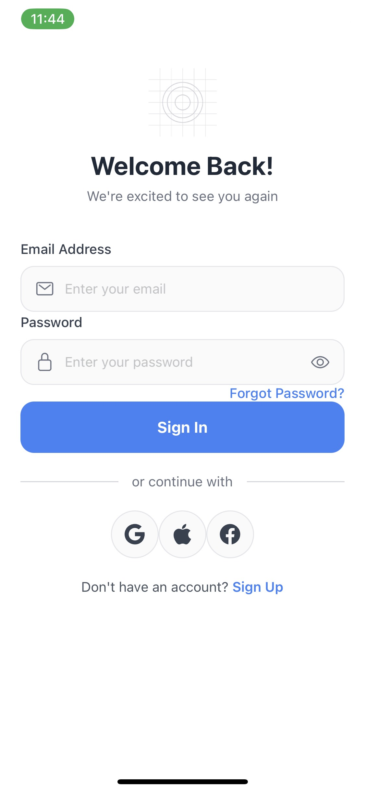
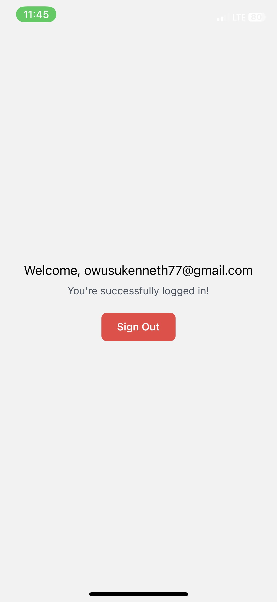

# React Native Auth Template with Expo & Supabase

<p align="center">
  
</p>

A modern, production-ready authentication template for React Native applications using Expo, Supabase, and NativeWind. Features a clean, minimalist design with full TypeScript support.

## 📑 Table of Contents

- [Features](#-features)
- [Screenshots](#-screenshots)
- [Technologies](#️-technologies)
- [Getting Started](#-getting-started)
  - [Prerequisites](#prerequisites)
  - [Installation](#installation)
- [Project Structure](#-project-structure)
- [Authentication Flow](#-authentication-flow)
- [Customization](#-customization)
  - [Theme Colors](#theme-colors)
  - [Components](#components)
- [Platform Specific Code](#-platform-specific-code)
- [Contributing](#-contributing)
- [License](#-license)
- [Acknowledgments](#-acknowledgments)
- [Contact](#-contact)

## 🌟 Features

- 🔐 Complete authentication flow
  - Email & Password Sign In/Sign Up
  - Password Reset
  - Session Management
  - Protected Routes
- 🎨 Modern UI with NativeWind (Tailwind CSS)
- 📱 Cross-platform (iOS & Android)
- 🏗️ Type-safe with TypeScript
- 📍 Expo Router for Navigation
- 🔄 Loading States & Error Handling
- 🎯 Form Validation
- 🎨 Reusable Components
- 📱 Responsive Design

## 📸 Screenshots

<p align="center">
  
  
  
  
</p>

## 🛠️ Technologies

- [Expo](https://expo.dev/) - React Native framework
- [Supabase](https://supabase.com/) - Backend & Authentication
- [NativeWind](https://www.nativewind.dev/) - Tailwind CSS for React Native
- [Expo Router](https://docs.expo.dev/routing/introduction/) - File-based routing
- [TypeScript](https://www.typescriptlang.org/) - Type safety
- [React Native](https://reactnative.dev/) - Cross-platform mobile development

## 🚀 Getting Started

### Prerequisites

- Node.js (v16 or newer)
- npm or yarn
- Expo CLI
- Supabase Account

### Installation

1. Clone the repository:

```bash
git clone https://github.com/Owusu1946/react-native-auth-template.git
cd react-native-auth-template
```

2. Install dependencies:

```bash
npm install
```
or
```bash
yarn install
```


3. Create a Supabase project and get your credentials:
   - Go to [Supabase](https://supabase.com/)
   - Create a new project
   - Get your `URL` and `anon` key

4. Create a `.env` file in the root directory:

```bash
SUPABASE_URL=your_supabase_url
SUPABASE_ANON_KEY=your_supabase_anon_key
```

5. Run the app:

```npx expo start```


## 📁 Project Structure

```plaintext
react-native-auth-template/
├── app/
│   ├── (auth)/
│   │   ├── sign-in.tsx
│   │   ├── sign-up.tsx
│   │   └── forgot-password.tsx
│   ├── (protected)/
│   │   └── home.tsx
│   └── index.tsx
├── components/
│   ├── AuthButton.tsx
│   ├── AuthHeader.tsx
│   ├── AuthInput.tsx
│   └── SocialAuth.tsx
├── contexts/
│   └── AuthContext.tsx
├── lib/
│   └── supabase.ts
├── assets/
└── images/
```


## 🔒 Authentication Flow

1. **Sign Up**
   - Email validation
   - Password strength requirements
   - Confirmation password matching
   - Error handling

2. **Sign In**
   - Email/Password validation
   - Session management
   - Protected routes

3. **Password Reset**
   - Email verification
   - Reset link handling
   - Success/Error feedback

4. **Protected Routes**
   - Authentication state checking
   - Automatic redirects
   - Loading states

## 🎨 Customization

### Theme Colors

Edit the `tailwind.config.js` file to customize your color scheme:

```js
// tailwind.config.js
module.exports = {
  theme: {
    colors: {
      primary: '#000000',
      secondary: '#FFFFFF',
    },
  },
}
```


### Components

All components are modular and can be found in the `components/` directory. Each component is fully typed and documented.

## 📱 Platform Specific Code

The template handles platform-specific behaviors automatically:

- Keyboard avoiding views
- Safe area insets
- Platform-specific styling
- Touch feedback

## 🤝 Contributing

Contributions are welcome! Please feel free to submit a Pull Request.

1. Fork the project
2. Create your feature branch (`git checkout -b feature/AmazingFeature`)
3. Commit your changes (`git commit -m 'Add some AmazingFeature'`)
4. Push to the branch (`git push origin feature/AmazingFeature`)
5. Open a Pull Request

## 📄 License

This project is licensed under the MIT License - see the [LICENSE](LICENSE) file for details.

## 👏 Acknowledgments

- [Expo Team](https://expo.dev/)
- [Supabase](https://supabase.com/)
- [NativeWind](https://www.nativewind.dev/)
- [React Native Community](https://reactnative.dev/community/overview)

## 📧 Contact

Your Name - [@okenneth2255](https://twitter.com/yourtwitter)

Project Link: [https://github.com/Owusu1946/react-native-auth-template](https://github.com/Owusu1946/react-native-auth-template)

---

Made with ❤️ by [Owusu1946](https://github.com/Owusu1946)